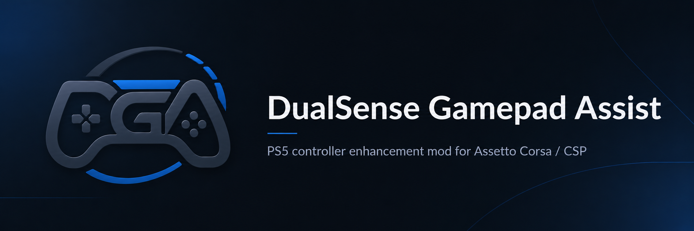

# DualSense Gamepad Assist

[简体中文](README_CN.md)

DualSense Gamepad Assist is a clean, in-game controller enhancement mod for Assetto Corsa / CSP. It is designed for PlayStation 5 DualSense controllers and brings together controller steering assist, Gyrosteer-style precision gyro steering, automatic clutch support, CSP native haptics, compatibility vibration, and adaptive trigger feedback.

The goal is simple: make a DualSense feel stronger, clearer, and more natural in Assetto Corsa without asking most players to tune a long list of parameters.

## Highlights

- **DualSense haptics** for grip, curbs, road texture, tire slip, collision impact, and shift impact.
- **Adaptive triggers** for brake resistance, throttle resistance, ABS pulses, wheelspin pulses, redline pulses, and shift rebound.
- **Precision gyro steering** with a Gyrosteer-style response for players who prefer direct motion steering.
- **Controller steering assist** for regular stick driving, with simplified settings for everyday use.
- **Feel presets** for balanced, comfort, strong, and custom setups.
- **In-game control panel** through CSP Gamepad FX, no external companion app required.

## Downloads

- [GitHub Releases](https://github.com/Adudumax/DualSense-Gamepad-Assist/releases)

Open the latest release and download the package that matches your language preference. Both English and Simplified Chinese packages are provided when available.

## Installation

1. Install Content Manager and Custom Shaders Patch `0.2.0` or newer.
2. Download the latest release package from GitHub Releases.
3. Open the archive and enter the `DualSense Gamepad Assist` folder.
4. Copy the `apps` and `extension` folders into your Assetto Corsa root folder, usually named `assettocorsa`.
5. In Content Manager, open `Settings -> Custom Shaders Patch -> Gamepad FX`.
6. Enable Gamepad FX and select `DualSense Gamepad Assist`.
7. Enter a session and open the app from the in-game sidebar.

A USB connection is recommended for the most reliable DualSense feedback. If haptics or adaptive triggers are missing, disable Steam Input for Assetto Corsa and enter the session again.

## Basic Use

Most players can start with the default balanced preset. Use the main panel for everyday settings, and open advanced settings only when you want to fine-tune steering, haptics, triggers, diagnostics, or restore defaults.

When precision gyro steering is enabled, regular steering assist is kept out of the way so the two steering modes do not fight each other. Haptics, adaptive triggers, and auto clutch can still remain active.

## Credits

Special thanks to:

- The author of **AC Advanced Gamepad Assist**, for the controller steering-assist foundation and inspiration.
- **Dmitrii Alekseev**, author of **Gyrosteer**, for the gyro steering concept and reference behavior.
- **x4fab and the Custom Shaders Patch contributors**, for CSP, Gamepad FX, and the APIs that make in-game controller feedback possible.
